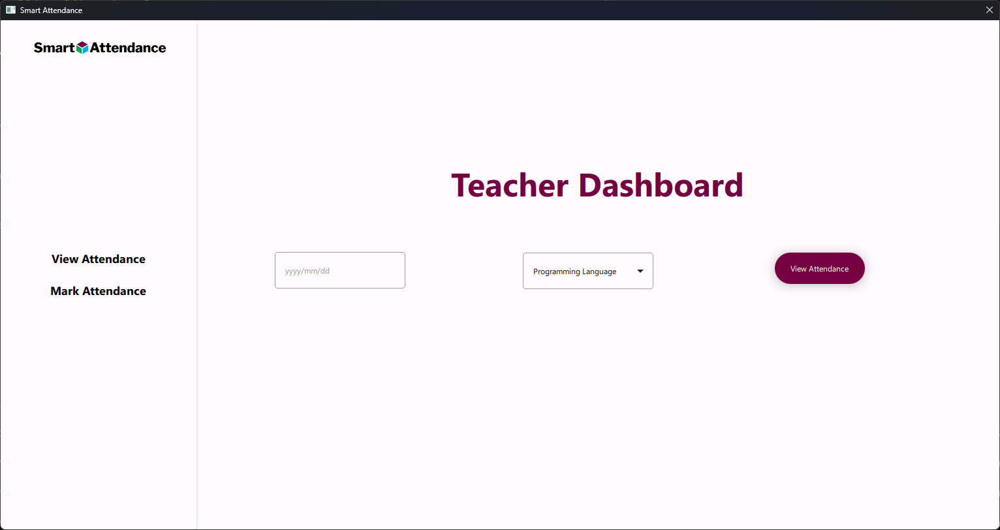

# Smart Attendance

## About

The Smart Attendance is an innovative software application that utilizes cutting-edge facial recognition technology to effortlessly monitor attendance in diverse settings like schools, universities, and offices. This revolutionary system eliminates the need for manual attendance, saving valuable time and resources, and enabling organizations to concentrate on more critical tasks. The state-of-the-art camera and database of pre-existing images allow the system to precisely track the presence of individuals and record their attendance automatically. Say farewell to the challenges of traditional attendance taking and embrace the future of attendance monitoring with Smart Attendance.

## Getting Started

### Installation

#### Clone the repository

```bash
# HTTPs
git clone https://github.com/MuhammadAbyaz/facial-recognition-based-attendance.git

# SSH
git clone git@github.com:MuhammadAbyaz/facial-recognition-based-attendance.git
```

#### Setting Virtual Environment

```bash
Python -m venv env

# Activating Virtual Environment
# Windows

.\env\Scripts\activate.bat

# Linux or Mac

source env/bin/activate
```

#### Update pip and setuptools

```bash
python -m pip install -U pip and setuptools

# Installing packages from requirements.txt

pip install -r requirements.txt

# Installing libraries from poetry

poetry install
```

# Screenshots

## Login Page


## Teacher Dashboard



## Admin Dashboard


